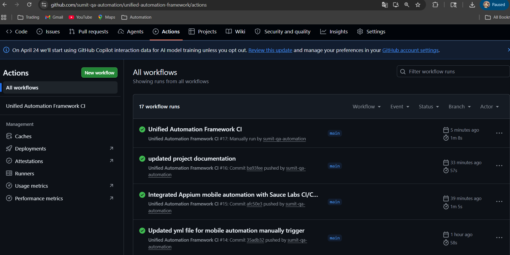
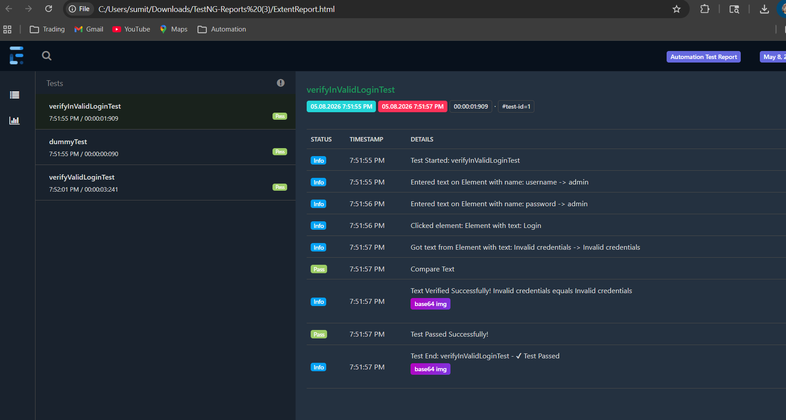
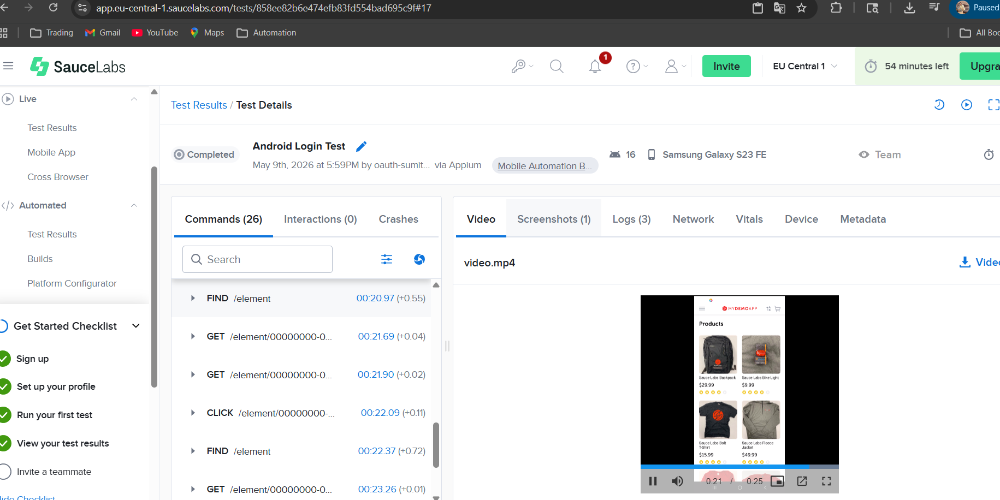

# Unified Automation Framework


Enterprise-grade Unified Automation Framework built using Selenium WebDriver, TestNG, REST Assured, Appium, Java, and Maven with integrated CI/CD pipeline using GitHub Actions.

---

# Framework Overview

This framework is designed to support scalable and maintainable automation testing for Web, API, and Mobile applications using industry-standard tools and enterprise automation practices.

## Supported Automation Types

- Web Automation using Selenium WebDriver
- API Automation using REST Assured
- Mobile Automation using Appium
- Sauce Labs Cloud Device Execution
- Android Mobile Automation Framework
- Parallel Execution Support
- Headless Browser Execution
- Smoke & Regression Suite Execution
- Extent Reporting with Screenshots
- Data-Driven Testing using Excel
- CI/CD Integration using GitHub Actions
- Nightly Regression Execution
- Manual Mobile Workflow Execution

---

# Key Features

- Selenium WebDriver UI Automation
- REST Assured API Automation
- Appium Mobile Automation
- Sauce Labs Cloud Integration
- Unified Web + API + Mobile Automation
- Page Object Model (POM) Design Pattern
- Parallel Test Execution
- Data-Driven Testing using Excel
- Extent Reports with Screenshots
- Mobile Extent Reporting Support
- GitHub Actions CI/CD Integration
- Smoke and Regression Suite Separation
- Headless Chrome Execution
- Logging using Log4j2
- Maven Build Lifecycle Integration
- Modular and Scalable Framework Design
- Recruiter-Friendly Framework Architecture

---

# Technology Stack

| Technology | Purpose |
|---|---|
| Java 17 | Programming Language |
| Selenium WebDriver | UI Automation |
| TestNG | Test Execution Framework |
| REST Assured | API Automation |
| Appium | Mobile Automation |
| Sauce Labs | Cloud Mobile Execution |
| Maven | Build Management |
| GitHub Actions | CI/CD |
| Extent Reports | Reporting |
| Apache POI | Excel Handling |
| Log4j2 | Logging |
| WebDriverManager | Driver Management |

---

# Framework Architecture

```text
Test Layer
    ↓
Page Object Layer
    ↓
Action Layer
    ↓
Core Driver Layer
    ↓
Utilities & Reporting Layer
```

---

# Project Structure

```text
unified-automation-framework
│
├── .github/workflows
│   └── maven.yml
│
├── src/main/java
│   ├── actions
│   │   ├── ActionDriver.java
│   │   └── MobileActionDriver.java
│   │
│   ├── core
│   │   ├── BaseClass.java
│   │   └── MobileBaseClass.java
│   │
│   ├── listeners
│   │   └── TestListener.java
│   │
│   ├── utilities
│   │   ├── ExtentReportManager.java
│   │   └── ExcelUtility.java
│
├── src/test/java
│   ├── api/tests
│   ├── web/tests
│   └── mobile/tests
│
├── src/test/java/mobile/pages
│   └── LoginPageMobile.java
│
├── src/test/resources
│   ├── testng-smoke.xml
│   ├── testng-regression.xml
│   └── testng-mobile.xml
│
├── test-output
│
├── pom.xml
│
└── README.md
```

---

# Test Suite Strategy

## Smoke Suite

Smoke suite executes critical validation scenarios.

Includes:
- Login Validation Tests
- Core UI Validation
- Critical Workflow Verification

Triggered on:
- Push Events
- Pull Requests
- Manual Workflow Execution

---

## Regression Suite

Regression suite executes complete automation coverage.

Includes:
- UI Automation Tests
- API Automation Tests
- Homepage Validation
- Login Validation
- Full Regression Coverage

Triggered on:
- Nightly Scheduled Execution

---

## Mobile Automation Suite

Mobile suite executes Android automation scenarios using Appium and Sauce Labs cloud devices.

Includes:
- Android Login Validation
- Mobile UI Validation
- Cloud Device Execution

Triggered on:
- Manual GitHub Actions Workflow Execution

---

# Mobile Automation Framework

The framework supports Android mobile automation using Appium and Sauce Labs cloud devices.

## Mobile Automation Features

- Android App Automation
- Appium Integration
- Sauce Labs Cloud Execution
- Mobile Page Object Model
- Mobile Action Driver
- Mobile Extent Reporting
- Unified Listener Support
- Screenshot Capture Support

---

# CI/CD Pipeline

The framework uses GitHub Actions for cloud-based automated execution.

## Pipeline Flow

```text
Code Push / Pull Request
            ↓
GitHub Actions Trigger
            ↓
Maven Build
            ↓
Smoke Suite Execution
            ↓
Extent Report Generation
            ↓
Artifact Upload
```

---

# GitHub Actions Workflow Features

- Automated Build Validation
- Cloud-Based Test Execution
- Headless Browser Execution
- Maven Dependency Caching
- Smoke Suite Execution on Push
- Regression Suite Execution on Schedule
- Manual Mobile Automation Workflow
- Secure GitHub Secrets Integration
- Sauce Labs Cloud Mobile Execution
- TestNG Report Archival
- Extent Report Artifact Upload

---

# Nightly Regression Execution

Regression suite executes automatically every night using GitHub Actions scheduler.

```yaml
schedule:
  - cron: '30 18 * * *'
```

Execution Time:
- 12:00 AM IST

---

# Parallel Execution

Framework supports parallel execution using TestNG.

```xml
parallel="classes"
thread-count="4"
```

---

# Data-Driven Testing

The framework supports Excel-based test execution using Apache POI.

Supported:
- Multiple User Login Validation
- Dynamic Test Data Handling
- Reusable Data Providers

---

# Reporting

The framework generates:

- Extent Reports
- TestNG Reports
- Maven Surefire Reports
- Mobile Execution Reports
- Screenshot Captures on Failures

Reports are automatically archived in GitHub Actions artifacts after execution.

---

# Running Tests Locally

## Run Smoke Suite

```bash
mvn test -DsuiteXmlFile=src/test/resources/testng-smoke.xml
```

---

## Run Regression Suite

```bash
mvn test -DsuiteXmlFile=src/test/resources/testng-regression.xml
```

---

## Run Mobile Suite

```bash
mvn clean test -DsuiteXmlFile=src/test/resources/testng-mobile.xml
```

---

## Run in Headless Mode

```bash
mvn clean test -Dbrowser=chrome -Dheadless=true
```

---

# Cloud Mobile Execution

The framework integrates with Sauce Labs for scalable cloud-based mobile execution.

Features:
- Android Cloud Device Execution
- Secure GitHub Secrets Integration
- Manual CI/CD Trigger Support
- Video Recording Support
- Cloud Execution Logs
- Cross-Device Scalability

---

# Framework Highlights

- Enterprise Automation Architecture
- Unified Web + API + Mobile Automation
- CI/CD Integrated Framework
- Cloud Execution Ready
- Parallel Execution Support
- Modular and Scalable Design
- Recruiter-Friendly Project Structure

---

# Future Enhancements

- Cross Browser Matrix Execution
- Docker Selenium Grid
- Allure Reporting
- BrowserStack Integration
- iOS Mobile Automation
- AI-Based Test Generation
- Self-Healing Automation
- Advanced Reporting Dashboards

---

# Framework Screenshots

## GitHub Actions CI/CD



---

## Extent Reports



---

## Sauce Labs Mobile Execution



---

# Author

## Sumit Gohatre

QA Automation Engineer | SDET

### GitHub Profile

https://github.com/sumit-qa-automation

---

# License

This project is intended for learning, automation framework development, and portfolio demonstration purposes.